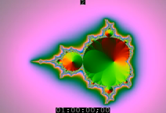

- [Homepage](//testpatterns.github.io/testpatterns/index.html)
- [Github Repository](//github.com/testpatterns/testpatterns)

#### Test Patterns

Test Pattern|Description
--|--
|[NTSC_480i_nonsquare_133_bt601_yuv420p_mandelbrot.ts](output/NTSC_480i_nonsquare_133_bt601_yuv420p_mandelbrot.ts) NTSC 480i  29.970fps interlaced H.262 MPEG2 video YUV420  AC3 audio
|[SMPTE_480i_nonsquare_133_bt601_yuv422p_mandelbrot.mxf](output/SMPTE_480i_nonsquare_133_bt601_yuv422p_mandelbrot.mxf) SMPTE BT.601 480i 29.970fps interlaced  H.264 AVC video YUV422 ITU-R BT.601 16-bit PCM audio

#### Dependencies

- [FFmpeg](//ffmpeg.org), tested using the [alternative FFmpeg tap](//github.com/homebrew-ffmpeg/homebrew-ffmpeg) build.
- [Imagemagick](//imagemagick.org), for creating favicons for the repository.

#### Tools

- [ltc-tools](https://github.com/x42/ltc-tools), for creation of linear-timecodes (LTC).
- [QCTools](https://github.com/bavc/qctools), Quality Control Tools for Video Preservation.
- [MediaInfo](https://mediaarea.net/en/MediaInfo), Convenient unified display of the most relevant technical and tag data for video and audio files.

#### References

- [ITU-R BT.601 : Studio encoding parameters of digital television for standard 4:3 and wide screen 16:9 aspect ratios](//www.itu.int/rec/R-REC-BT.601)
- [ITU-R BT.709 : Parameter values for the HDTV standards for production and international programme exchange](//www.itu.int/rec/R-REC-BT.709)
- [ITU-R BT.2020 : Parameter values for ultra-high definition television systems for production and international programme exchange](//www.itu.int/rec/R-REC-BT.2020)
- [EBU R 95 Safe Areas for 16:9 Television Production](https://tech.ebu.ch/docs/r/r095.pdf)
- [EBU R 128 Loudness Normalisation and Permitted Maximum Level of Audio Signals](https://tech.ebu.ch/docs/r/r128.pdf)
- [ITU Recommendation BS.1770 : Algorithms to measure audio programme loudness and true-peak audio level](https://www.itu.int/rec/R-REC-BS.1770/)
- [EBU Tech 3304 Multichannel Audio Line-up Tones](https://tech.ebu.ch/docs/tech/tech3304.pdf)
- [Graham's Line Identification Tone System (GLITS)](https://en.wikipedia.org/wiki/GLITS)
- [Black & Lane's Ident Tones for Surround (BLITS)](https://en.wikipedia.org/wiki/Black_%26_Lane%27s_Ident_Tones_for_Surround)
- [SMPTE RP 8, Safe Title Area for TV Transmission](https://www.smpte.org/standards/document-index/RP)
- [SMPTE RP 13, Safe Action Area for TV Transmission](https://www.smpte.org/standards/document-index/RP)
- [SMPTE ST 2046-1:2009, Specifications for Safe Action and Safe Title Areas for Television](https://ieeexplore.ieee.org/document/7291650)
- [SMPTE RP 2046-2:2009, Safe Areas for Protection of Alternate Aspect Ratios](https://ieeexplore.ieee.org/document/7290234)
- [SMPTE RP 219:2002 High-Definition, Standard-Definition Compatible Color Bar Signal](https://ieeexplore.ieee.org/document/7289865)
- [SMPTE EG 1:1990, Alignment Color Bar Test Signal for Television Picture Monitors](https://ieeexplore.ieee.org/document/7291491)
- [SMPTE ST 12-1:2014, Time and Control Code](https://ieeexplore.ieee.org/document/7291029)
- [SMPTE ST 12-2:2014, Transmission of Time Code in the Ancillary Data Space](https://ieeexplore.ieee.org/document/7290816)
- [SMPTE ST 12-3:2016, Time Code for High Frame Rate Signals and Formatting in the Ancillary Data Space](https://ieeexplore.ieee.org/document/7438725)

#### Notes

- [Mastering Github Flavoured Markdown](//guides.github.com/features/mastering-markdown/)
- [Semantic Versioning 2.0.0](//semver.org/)
- [Favicon Cheat Sheet](//github.com/audreyr/favicon-cheat-sheet)
- [Github Maximum File Size](//help.github.com/en/github/managing-large-files/working-with-large-files)
- [Removing Sensitive info from Github](//help.github.com/en/github/authenticating-to-github/removing-sensitive-data-from-a-repository)
